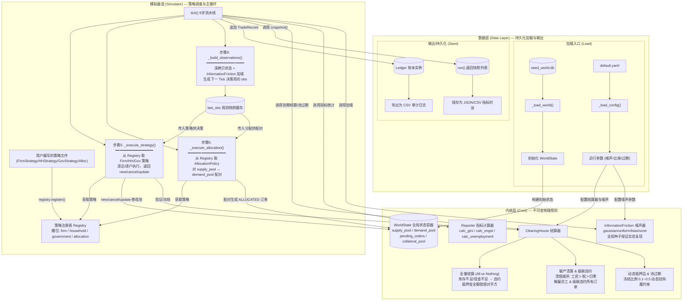

```mermaid
flowchart TB
    subgraph DataLayer["数据层 (Data Layer) — 持久化加载与输出"]
        direction LR
        subgraph Load["加载入口 (Load)"]
            DB[(seed_world.db)] --> Loader["_load_world()"]
            YAML[default.yaml] --> ConfigLoader["_load_config()"]
            Loader --> InitWS["初始化 WorldState"]
            ConfigLoader --> Params["运行参数 (噪声/比率/过期)"]
        end
        subgraph Save["输出/持久化 (Save)"]
            LedgerInst[("Ledger 账本实例")] --> Export1["导出为 CSV 审计日志"]
            Snap[("run() 返回快照列表")] --> Export2["保存为 JSON/CSV 指标时序"]
        end
    end

    subgraph SimLayer["模拟器层 (Simulator) — 策略调度与主循环"]
        direction TB
        Reg["策略注册表 Registry<br/>槽位: firm / household / government / allocation"]
        UserPolicies["用户编写的策略文件<br/>(FirmStrategy/HHStrategy/GovStrategy/Alloc)"] -->|"registry.register()"| Reg

        Tick["tick() 9步流水线"]
        Tick --> Step5["步骤5: _execute_strategy()<br/>━━━━━━━━━━━━━━━━━<br/>从 Registry 取 Firm/HH/Gov 策略<br/>逐企/逐户执行，返回 new/cancel/update"]
        Tick --> Step6["步骤6: _execute_allocation()<br/>━━━━━━━━━━━━━━━━━<br/>从 Registry 取 AllocationPolicy<br/>对 supply_pool ↔ demand_pool 配对"]
        Tick --> Step9["步骤9: _build_observations()<br/>━━━━━━━━━━━━━━━━━<br/>深拷贝状态 + InformationFriction 加噪<br/>生成下一 Tick 决策用的 obs"]
        
        Step9 --> ObsCache[("last_obs 观测快照缓存")]
        ObsCache -->|"传入策略供决策"| Step5
        ObsCache -->|"传入分配供配对"| Step6
        
        Step5 -->|"获取策略"| Reg
        Step6 -->|"获取策略"| Reg
    end

    subgraph CoreLayer["内核层 (Core) — 不可变物理规则"]
        direction TB
        State[("WorldState 全局状态容器<br/>supply_pool / demand_pool<br/>pending_orders / collateral_pool")]
        
        CH["ClearingHouse 结算器"]
        CH --> CH1["全量结算 (All-or-Nothing)<br/>库存不足/现金不足 → 违约<br/>抵押金全额赔偿对手方"]
        CH --> CH2["破产清算 & 级联违约<br/>清偿顺序: 工资＞税＞归零<br/>解雇员工 & 级联违约所有订单"]
        CH --> CH3["动态抵押品 & 池过期<br/>冻结比例 0.1~0.5 动态挂钩履约率"]
        
        Noise["InformationFriction 噪声器<br/>gaussian/uniform/bias/none<br/>全局种子保证实验复现"]
        Rep["Reporter 指标计算器<br/>calc_gini / calc_engel / calc_unemployment"]
    end

    %% ===== 加载流向 =====
    InitWS -->|"构建初始状态"| State
    Params -->|"配置结算器与噪声"| CH
    Params -->|"配置噪声参数"| Noise

    %% ===== 写入/持久化流向 =====
    Tick -->|"追加 TradeRecord"| LedgerInst
    Tick -->|"调用 snapshot()"| Snap
    
    %% ===== 模拟器调度内核 =====
    Tick -->|"调用到期结算/池过期"| CH
    Tick -->|"调用指标统计"| Rep
    Tick -->|"调用加噪"| Noise
    
    %% ===== 策略执行修改状态 =====
    Step5 -->|"new/cancel/update 修改池"| State
    Step6 -->|"配对生成 ALLOCATED 订单"| State
    Step5 -->|"验证/冻结"| CH

```